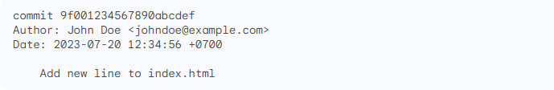

# คำสั่ง git ที่ขึ้นต้นด้วยอักษร A

git add  เพิ่มไฟล์หรือโฟลเดอร์ลงใน staging area

git amend แก้ไข commit ก่อนหน้า

 git annotate แสดงข้อมูลเกี่ยวกับ commit

 

  git apply นำไปใช้กับการเปลี่ยนแปลงจาก commit

  

  