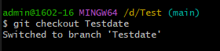

# คำสั่ง git ที่ขึ้นต้นด้วยอักษร B

git branch สร้างสาขาใหม่

 git branch-and-merge การสร้างสาขาใหม่และ merge กลับไปยังสาขาหลัก

 

 git branch-create สร้างสาขาใหม่จากสาขาที่มีอยู่

 

 git branch-rename เปลี่ยนชื่อสาขา

 