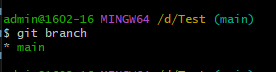
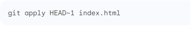

# คำสั่ง git ที่ขึ้นต้นด้วยอักษร B

# การใช้คำสั่ง git branch

การใช้ git branch จะเป็นการเช็ค branch ที่เราอยู่นะปัจจุบัน ถ้าสร้างใหม่ให้พิมพ์ชื่อที่ต้องการลงไปเช่น git branch Test จะเป็นการสร้าง branch ใหม่ขึ้นมา

# การใช้คำสั่ง git blame 

จะเป็นการดูการแก้ไขประวัติไฟล์