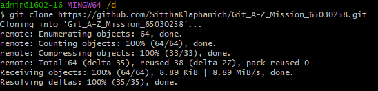

# คำสั่ง git ที่ขึ้นต้นด้วยอักษร C

# การใช้คำสั่ง git clone

เป็นการก้อปปี้โปรเจคจำลองมาจากโปรเจคหลัก โดยเราจะสามารถเปลี่ยนแปลงไฟล์ในโปรเจคจำลองนี้ได้โดยที่ไม่กระทบโปรเจคหลัก (ไฟล์จำลองที่เราทำการเปลี่ยนแปลงจะเรียกว่า local repository และไฟล์หลักที่อยู่คนละที่จะเรียกว่า remote repository)

# การใช้คำสั่ง git commit 
