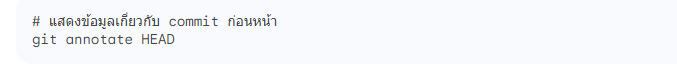
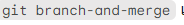

# คำสั่ง git ที่ขึ้นต้นด้วยอักษร C

# การใช้คำสั่ง git clone

เป็นการก้อปปี้โปรเจคจำลองมาจากโปรเจคหลัก โดยเราจะสามารถเปลี่ยนแปลงไฟล์ในโปรเจคจำลองนี้ได้โดยที่ไม่กระทบโปรเจคหลัก (ไฟล์จำลองที่เราทำการเปลี่ยนแปลงจะเรียกว่า local repository และไฟล์หลักที่อยู่คนละที่จะเรียกว่า remote repository)

# การใช้คำสั่ง git commit 

Git commit คือคำสั่งที่ใช้บันทึกการเปลี่ยนแปลงของไฟล์ต่างๆ ในโปรเจ็คต์ลงสู่ระบบ 
-m ย่อมาจาก message

# การใช้คำสั่ง git checkout

เป็นคำสั่งที่ใช้สำหรับสลับ ไปยัง branch หรือ Commit ที่เราเคยสร้างไว้  ดังในภาพ

