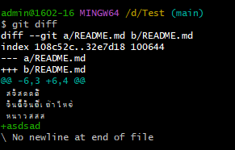
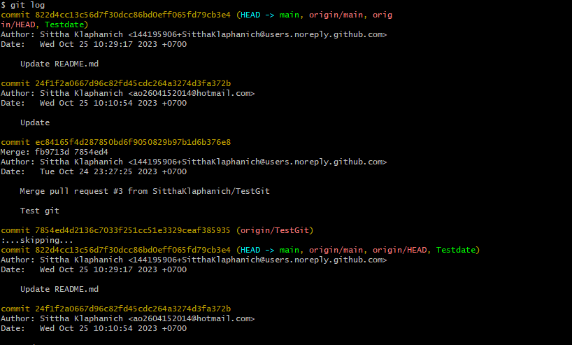

# คำสั่ง git ที่ขึ้นต้นด้วยอักษร C

 git checkout เปลี่ยนสาขาที่ใช้งานอยู่ ใช้สำหรับเปลี่ยนสาขาที่ใช้งานอยู่ สามารถใช้เพื่อเปลี่ยนสาขาที่ใช้งานอยู่เป็นสาขาอื่นหรือเพื่อกลับไปที่สาขาเริ่ม

 

  git clone สร้างสำเนาของ repository ที่มีอยู่

  คำสั่ง clone ใช้สำหรับสร้างสำเนาของ repository ที่มีอยู่ สามารถใช้เพื่อสร้างสำเนาของ repository บนคอมพิวเตอร์เครื่องอื่นหรือบน cloud

  

  git commit บันทึกการเปลี่ยนแปลงเป็น commit ใหม่

  คำสั่ง commit ใช้สำหรับบันทึกการเปลี่ยนแปลงเป็น commit ใหม่ สามารถใช้เพื่อบันทึกการเปลี่ยนแปลงทั้งหมดที่ยังไม่ได้ commit ให้เป็น commit ใหม่

  

  git config กำหนดค่าสำหรับ Git
  คำสั่ง config ใช้สำหรับกำหนดค่าสำหรับ Git สามารถใช้เพื่อกำหนดค่าต่างๆ เช่น ที่อยู่อีเมล ชื่อผู้ใช้ และการตั้งค่าการเผยแพร่

  