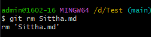
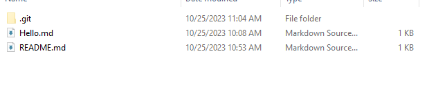

# คำสั่ง git ที่ขึ้นต้นด้วยอักษร D

 git diff
 คำสั่ง diff ใช้สำหรับแสดงความแตกต่างระหว่าง commit สอง commit สามารถใช้เพื่อเปรียบเทียบการเปลี่ยนแปลงระหว่าง commit สอง commit หรือระหว่างสาขาสองสาขา

 

 git describe
 คำสั่ง describe ใช้สำหรับสร้างคำอธิบายของ commit โดยใช้ชื่อสาขา สามารถใช้เพื่อสร้างคำอธิบายสั้นๆ ของ commit ที่ใช้ชื่อสาขาปัจจุบันหรือชื่อสาขาต้นทางของ commit

 