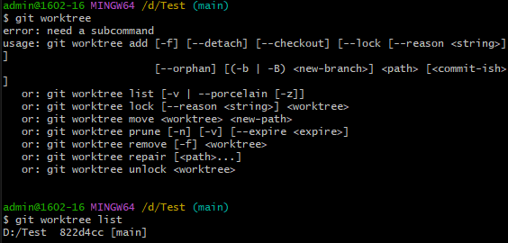
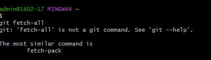

# คำสั่ง git ที่ขึ้นต้นด้วยอักษร F

git fetch-all
คำสั่ง fetch-all ใช้สำหรับดึงการเปลี่ยนแปลงทั้งหมดจาก remote repository สามารถใช้เพื่อรับการเปลี่ยนแปลงจาก remote repository ลงใน local repository ของคุณ รวมถึงการเปลี่ยนแปลงจากสาขาใหม่และแท็กใหม่

