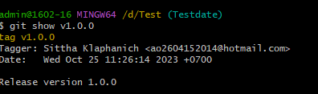

# คำสั่ง git ที่ขึ้นต้นด้วยอักษร G

git grep
คำสั่ง grep ใช้สำหรับค้นหาข้อความในไฟล์หรือ commit สามารถใช้เพื่อค้นหาข้อความเฉพาะในไฟล์ทั้งหมดใน repository หรือค้นหาข้อความเฉพาะใน commit ทั้งหมด

gitk
gitk
คำสั่ง gitk ใช้สำหรับแสดงประวัติการพัฒนา สามารถใช้เพื่อแสดงประวัติการพัฒนาของไฟล์หรือโฟลเดอร์ทั้งหมดใน repository หรือแสดงประวัติการพัฒนาของ commit ทั้งหมด

grep
ใช้สำหรับค้นหาข้อความในไฟล์หรือ commit ใน repository Git ของคุณ คุณสามารถใช้คำสั่งนี้เพื่อค้นหาข้อความเฉพาะในไฟล์ทั้งหมดใน repository หรือค้นหาข้อความเฉพาะใน commit ทั้งหมด

Git GUI 

คือส่วนต่อประสานผู้ใช้แบบกราฟิก (GUI) สำหรับ Git ซึ่งช่วยให้คุณสามารถทำงานกับ repository Git ของคุณได้โดยไม่ต้องใช้คำสั่งข้อความ

