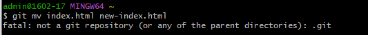

# คำสั่ง git ที่ขึ้นต้นด้วยอักษร M

git merge
คำสั่ง merge ใช้สำหรับรวมการเปลี่ยนแปลงจากสาขาหนึ่งไปยังสาขาอื่น สามารถใช้เพื่อรวมการเปลี่ยนแปลงจากสาขาการพัฒนาไปยังสาขาหลัก หรือเพื่อรวมการเปลี่ยนแปลงจากสาขาสาขาย่อยไปยังสาขาหลัก

git mv
คำสั่ง mv ใช้สำหรับย้ายหรือเปลี่ยนชื่อไฟล์หรือโฟลเดอร์ สามารถใช้เพื่อย้ายหรือเปลี่ยนชื่อไฟล์หรือโฟลเดอร์ใน repository Git

git maintenance

Git maintenance คือคำสั่งของ Git ที่ใช้ในการบำรุงรักษาที่เก็บ Git ของคุณ โดยคำสั่งนี้สามารถทำงานได้ทั้งแบบอัตโนมัติและแบบกำหนดเอง