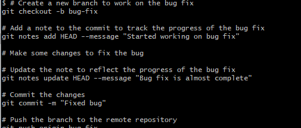

# คำสั่ง git ที่ขึ้นต้นด้วยอักษร N

git notes
ใช้เพื่อจัดการโน้ตที่แนบมากับไฟล์หรือที่เก็บ โน้ตเป็นข้อความที่แนบมากับไฟล์หรือที่เก็บ Git สามารถใช้เพื่อจัดเก็บข้อมูลเกี่ยวกับไฟล์หรือที่เก็บ เช่น ข้อมูลการเขียนโปรแกรมหรือรายละเอียดการเผยแพร่  

