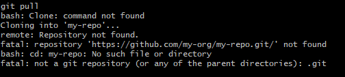

# คำสั่ง git ที่ขึ้นต้นด้วยอักษร P

git pull 
คือคำสั่งที่ใช้เพื่อดึงและดาวน์โหลดเนื้อหาจากที่เก็บระยะไกลและอัปเดตที่เก็บในเครื่องของคุณให้ตรงกับเนื้อหานั้น เป็นการรวมคำสั่ง git fetch และ git merge

git push
 คือคำสั่งที่ใช้เพื่ออัปโหลดการเปลี่ยนแปลงจากที่เก็บในเครื่องของคุณไปยังที่เก็บระยะไกล เป็นการรวมคำสั่ง git add git commit และ git send-pack

 