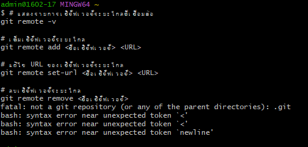

# คำสั่ง git ที่ขึ้นต้นด้วยอักษร R

git reset 

 ใช้เพื่อรีเซ็ตสถานะของที่เก็บ คุณสามารถใช้ git reset เพื่อรีเซ็ตสาขาเป็นสถานะก่อนหน้า หรือเพื่อรีเซ็ต HEAD เป็นสถานะก่อนหน้า

 

 git remote
 ใช้เพื่อจัดการที่เก็บระยะไกล คุณสามารถใช้ git remote เพื่อเพิ่มที่เก็บระยะไกลใหม่ ลบที่เก็บระยะไกลที่มีอยู่ หรือเปลี่ยนชื่อที่เก็บระยะไกลที่มีอยู่

 

 git range-diff

 คือคำสั่งที่ใช้เพื่อเปรียบเทียบสองช่วงของการคอมมิต ตัวอย่างเช่น คุณสามารถใช้ git range-diff เพื่อเปรียบเทียบการเปลี่ยนแปลงระหว่างสองสาขาหรือระหว่างสองเวอร์ชันของไฟล์เดียวกัน

git restore
ใช้สำหรับเรียกคืนการเปลี่ยนแปลงในโค้ด Git หรือไฟล์ที่ยังไม่ถูก stage หรือ commit โดยมีสามวิธีหลักในการใช้งาน:

git rm 
คือคำสั่งที่ใช้เพื่อลบไฟล์และไดเร็กทอรีออกจากดัชนี Git และ Working Tree ของที่เก็บ Git

