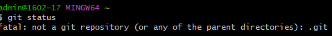
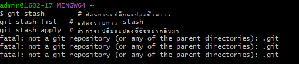

# คำสั่ง git ที่ขึ้นต้นด้วยอักษร S

git status คำสั่ง git status ใช้สำหรับการแสดงสถานะปัจจุบันของโปรเจกต์ Git โดยรายงานถึงไฟล์ที่มีการเปลี่ยนแปลง, ไฟล์ที่ยังไม่ถูกเพิ่มใน staging area, และสถานะของ branch ปัจจุบัน. คำสั่งนี้ช่วยในการตรวจสอบสถานะของโปรเจกต์และตรวจสอบการ 

git stash
 คำสั่ง git stash ใช้สำหรับการซ่อนการเปลี่ยนแปลงชั่วคราวที่ยังไม่ถูก commit หรือการ stage เพื่อให้คุณสามารถทำงานกับ branch อื่น ๆ หรือการ checkout branch ใหม่โดยไม่ต้อง commit การเปลี่ยนแปลงเดิม. คำสั่งนี้ช่วยในการบันทึกการเปลี่ยนแปลงที่คุณกำลังทำแต่ยังไม่พร้อมที่จะ commit.

 