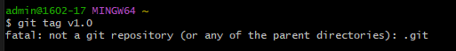

# คำสั่ง git ที่ขึ้นต้นด้วยอักษร T

git tag
 เป็นคำสั่งที่ใช้สำหรับการจัดการและสร้าง tags (ป้ายชื่อ) บน commit ใน Git repository. Tags ใช้ในการทำเครื่องหมายบน commit เพื่อระบุเวอร์ชันหรือการปล่อยระบบเป็นรุ่น (version) และมักถูกใช้ในการเป็นตัวบ่งชี้ของ commit ที่มีความสำคัญ เช่นการปล่อยรุ่นที่มีการแก้ไขหรือการอัพเดต.
 
 