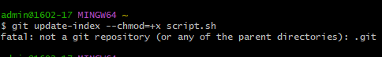

# คำสั่ง git ที่ขึ้นต้นด้วยอักษร U

git update-index

เป็นคำสั่งที่ใช้สำหรับการอัพเดต (update) ค่าใน Git index (staging area) โดยทั่วไปใช้ในกรณีที่คุณต้องการเปลี่ยนแปลงค่าตัวแปร Git เช่น --chmod, --assume-unchanged, หรือ --skip-worktree สำหรับไฟล์เฉพาะ. คำสั่งนี้ใช้สำหรับการจัดการเรื่องข้อมูลเบื้องต้นของ Git และไม่ได้ใช้บ่อยในกรณีทั่วไป.

