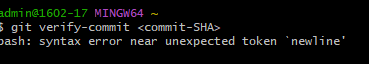

# คำสั่ง git ที่ขึ้นต้นด้วยอักษร V

git verify-commit
 เป็นคำสั่งที่ใช้ในการตรวจสอบความถูกต้องของ commit object ใน Git โดยตรวจสอบว่า commit object นั้นสมบูรณ์และไม่เสี่ยงต่อความเป็นอันตรายหรือการข้อมูลที่อาจถูกเปลี่ยนแปลงในอนาคต.

 