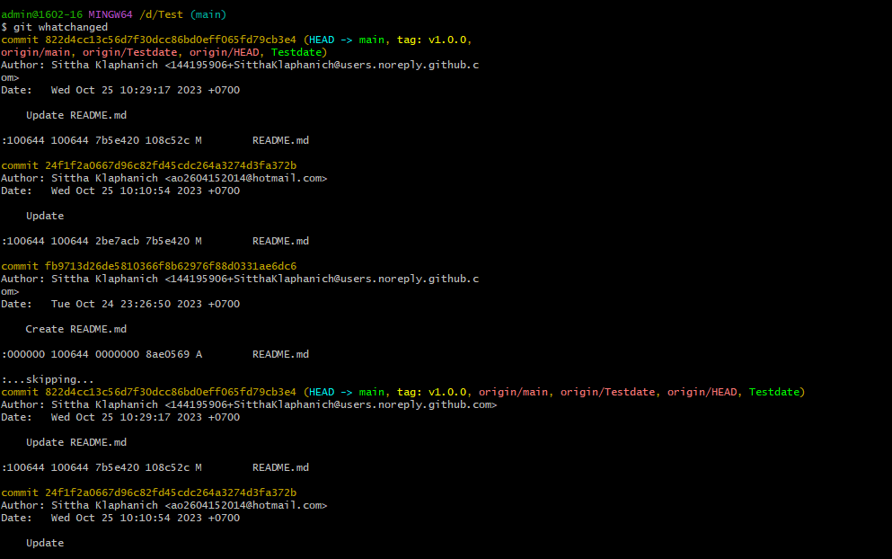

# คำสั่ง git ที่ขึ้นต้นด้วยอักษร W

# การใช้คำสั่ง git worktree

Git worktree คือ พื้นที่ทำงานที่แยกจากกันของ Git บนเครื่องเดียวกัน แต่ละ worktree มีไฟล์และประวัติของตัวเอง ช่วยให้เราสามารถทำงานกับหลายเวอร์ชัน

# การใช้คำสั่ง git whatchanged

 เป็นคำสั่งที่ใช้แสดงประวัติของการเปลี่ยนแปลงที่เกิดขึ้นใน repository ของคุณ โดยแสดงรายละเอียดของ commit ทั้งหมดรวมถึงไฟล์ที่เปลี่ยนแปลง, วันที่เปลี่ยนแปลง, และผู้เปลี่ยนแปลง. 