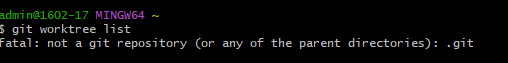

# คำสั่ง git ที่ขึ้นต้นด้วยอักษร W

git Worktree
 คือคำสั่งที่ใช้ในการจัดการกับ worktree หรือการทำงานบนหลาย working directories ในโปรเจกต์ Git ที่เดียวกัน. คำสั่งนี้เป็นเครื่องมือที่มีประโยชน์เมื่อคุณต้องการทำงานพร้อมกันในหลายสาขาหรือแฟ้มต่าง ๆ ในโปรเจกต์ Git 

 