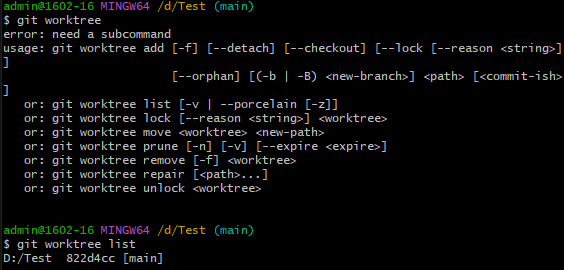

# คำสั่ง git ที่ขึ้นต้นด้วยอักษร W

# การใช้คำสั่ง git worktree

Git worktree คือ พื้นที่ทำงานที่แยกจากกันของ Git บนเครื่องเดียวกัน แต่ละ worktree มีไฟล์และประวัติของตัวเอง ช่วยให้เราสามารถทำงานกับหลายเวอร์ชัน